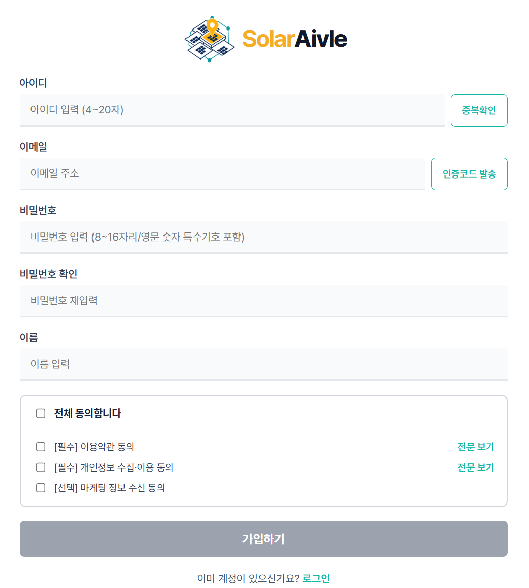
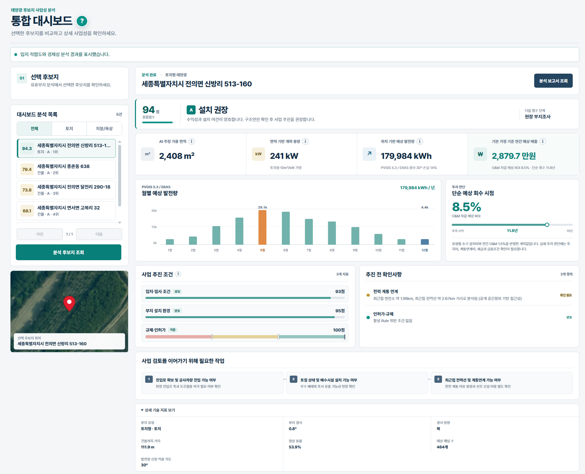
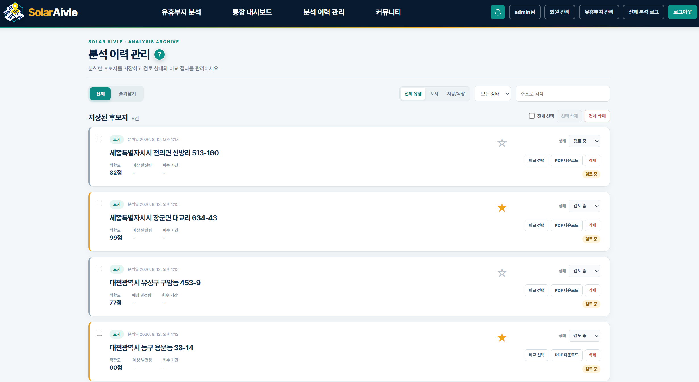
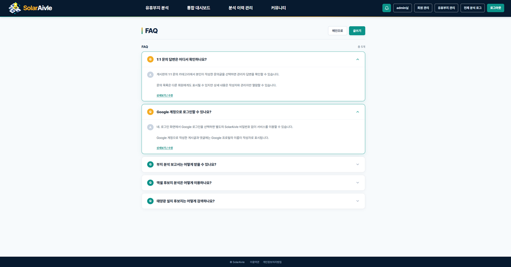
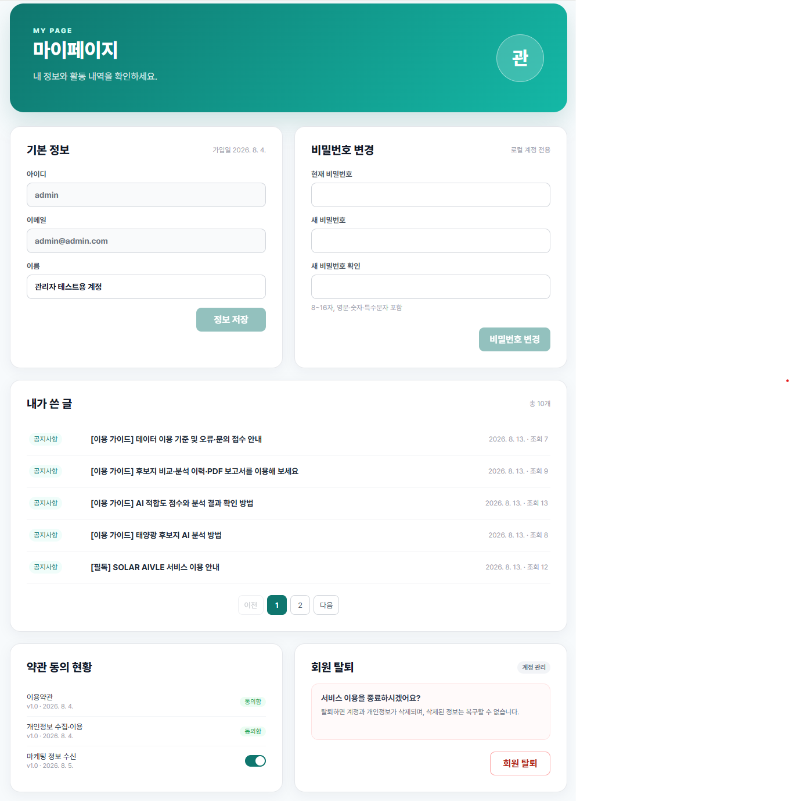

# SolarAivle Frontend

AI 기반 유휴공간 태양광 설치 우선순위 분석 서비스 — **프론트엔드**

KT AIVLE BIG PROJECT · AI_07반_19조

> 백엔드 서버(Spring Boot)에 대한 설명은 [백엔드 레포](https://github.com/AIVLE-big-project-19/backEnd)를 참고해주세요.

---

## 이 앱이 하는 일

- 회원가입/로그인 (아이디·비밀번호, Google OAuth), 아이디/비밀번호 찾기
- 지역·유형별 유휴부지 후보지 검색 및 필터 조회, 지도 연동 위치 확인
- 통합 대시보드 — 후보지 AI 분석 실행, 최대 3개 후보지 비교
- 분석 결과 PDF 보고서 다운로드/재다운로드
- 분석 이력 자동 저장 및 상태 관리(즐겨찾기 등)
- 커뮤니티(공지사항·FAQ·1:1 문의), 게시글 작성/관리, 실시간 알림
- 마이페이지
- SolarAivle 분석 보고서 기반 챗봇 질의응답

## 화면 미리보기

| 회원가입 | 유휴부지 검색 |
|---|---|
|  |  |

| 통합 대시보드 | 분석 이력 관리 |
|---|---|
|  |  |

| 커뮤니티 (FAQ) | 마이페이지 |
|---|---|
|  |  |

## 기술 스택

- **Framework**: React 19, Vite
- **라우팅**: React Router 7
- **HTTP**: axios
- **지도**: OpenLayers (ol)
- **에디터**: TipTap (게시판 글쓰기)
- **마크다운**: react-markdown + remark-gfm (약관/챗봇 응답 렌더링)
- **테스트**: Vitest, Testing Library
- **인증**: JWT (Access/Refresh Token), Google OAuth 2.0

## 로컬 개발 환경 설정

Node.js ≥ 22.4.0 필요.

```bash
npm install
cp .env.example .env.local   # VITE_GOOGLE_CLIENT_ID 채우기
npm run dev
```

`/api` 요청은 개발 서버가 `http://localhost:8080`(백엔드)으로 프록시합니다. 다른 백엔드 주소를 쓰려면 `VITE_API_PROXY_TARGET` 환경변수로 재정의.

## 스크립트

| 명령 | 설명 |
|---|---|
| `npm run dev` | 개발 서버 실행 |
| `npm run build` | 프로덕션 빌드 |
| `npm run lint` | ESLint 검사 |
| `npm run test` | 테스트 실행 (Vitest) |
| `npm run preview` | 빌드 결과 미리보기 |

## 프로젝트 구조

```
src/
├── api/            # 백엔드 API 호출 모듈 (도메인별 axios 래퍼)
├── auth/           # 토큰 저장, Google OAuth 처리
├── components/     # 공통 컴포넌트
├── context/        # AuthContext 등 전역 상태
├── hooks/          # 커스텀 훅 (useCountdown, useTerms 등)
├── notifications/  # 에러 토스트 등 알림 스토어
├── pages/          # 라우트 단위 페이지
├── router/         # 라우팅 설정
├── utils/          # 공통 유틸 (비밀번호/이메일 검증 등)
└── constants/      # 상수
```

## 인증 흐름

- 로그인 성공 시 백엔드에서 `accessToken`/`refreshToken` 발급
- `accessToken`은 메모리 보관, `refreshToken`은 "로그인 상태 유지" 여부에 따라 localStorage/sessionStorage에 저장
- Google 로그인은 OAuth 콜백 페이지에서 인가 코드를 백엔드로 전달해 토큰 교환

## 테스트

```bash
npm run test
```

## 배포

- AWS Amplify (정적 호스팅)
- 상세 배포 구성은 [백엔드 레포 deploy/README.md](https://github.com/AIVLE-big-project-19/backEnd/blob/main/deploy/README.md) 참고

## 팀 구성

KT AIVLE BIG PROJECT AI_07반_19조 · 6인 팀 프로젝트

| 이름 | 역할 | 담당 업무 |
|---|---|---|
| 신가람 (조장) | AI Engineering | 항공 데이터셋 구축, YOLOv8 기반 유휴공간 면적 산출, 태양광 설치 조건·이격거리 분석, 패널 배치 시뮬레이션 |
| 김경은 | Data / AI Engineering | 프로젝트 기획, ML 학습 데이터 전처리 파이프라인, Ranking ML 구현·검증·SHAP 분석, AI Agent 구현 |
| 강승혁 | Full-stack Engineering | 수익성 분석·의사결정 대시보드, PVGIS 연계 발전량 예측 시각화, 커뮤니티·권한 관리·S3 파일 저장 |
| 최지흠 | Full-stack Engineering | Vision AI·Ranking ML·정책자금 Agent 순차 호출/결합 백엔드 파이프라인, 지도 기반 후보지 매칭, PDF 기반 챗봇 구현 |
| 최현호 | Data / Full-stack Engineering | 유휴공간 데이터 전처리, 분석 이력 관리 API/UI, React 공통 UI/UX 컴포넌트, 실시간 알림 인터랙션 |
| 한승연 | Full-stack Engineering / Infra | 로그인/회원가입 풀스택 구현, 개인정보 마스킹·AES 암호화, ECS·Amplify 배포 파이프라인, AI 서비스 플로우 설계 |
